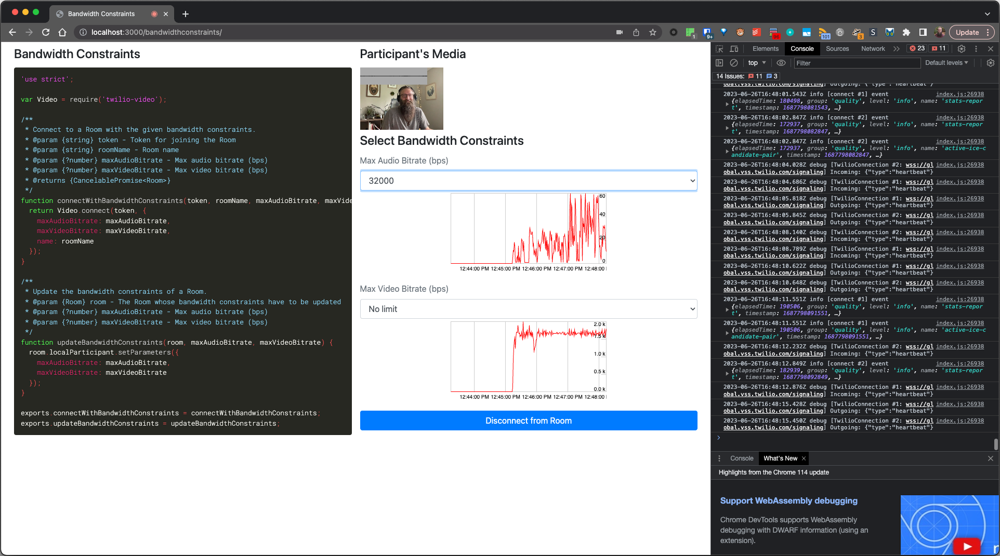
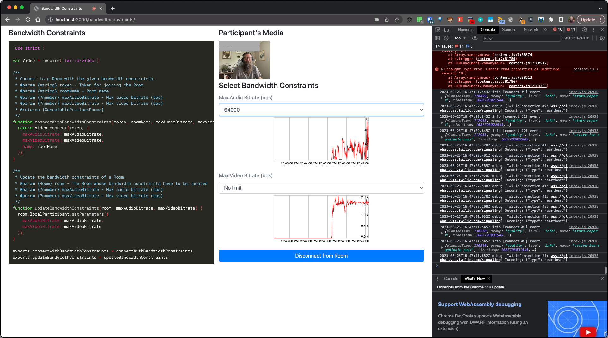
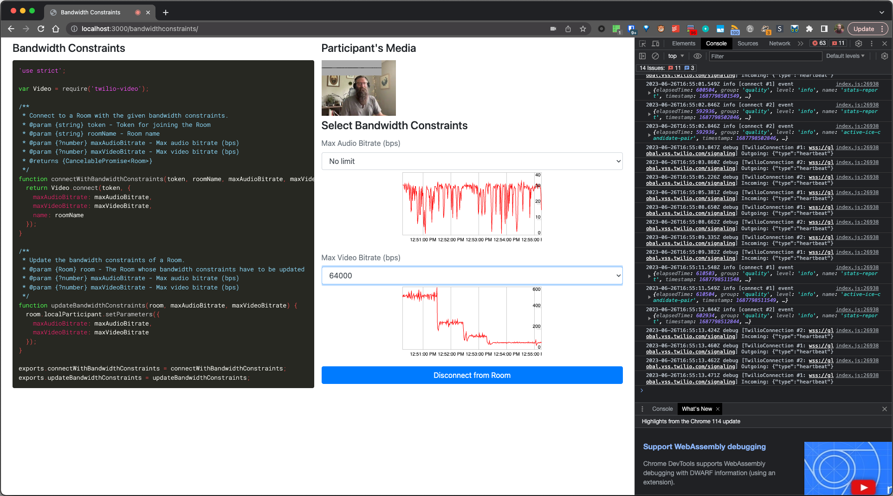
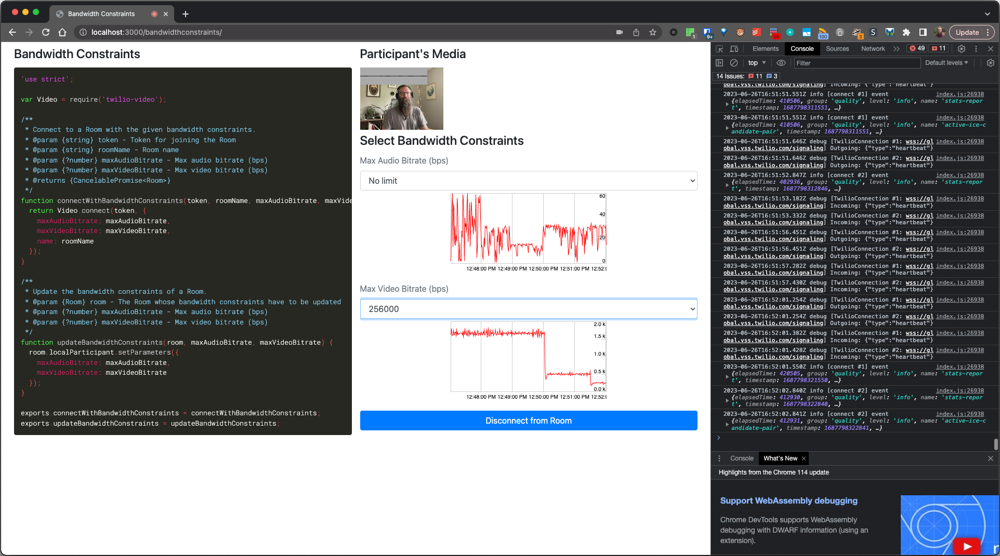
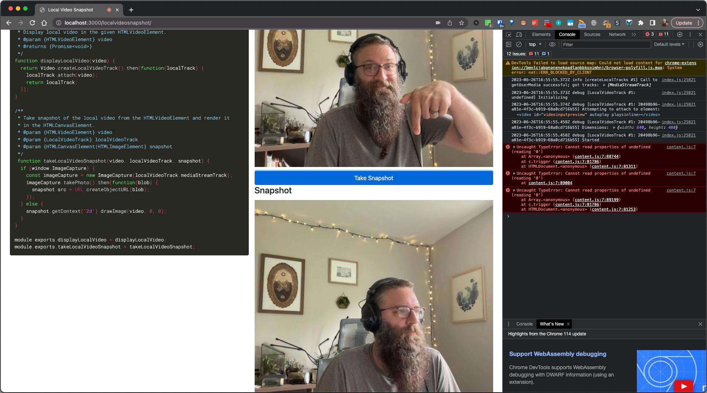
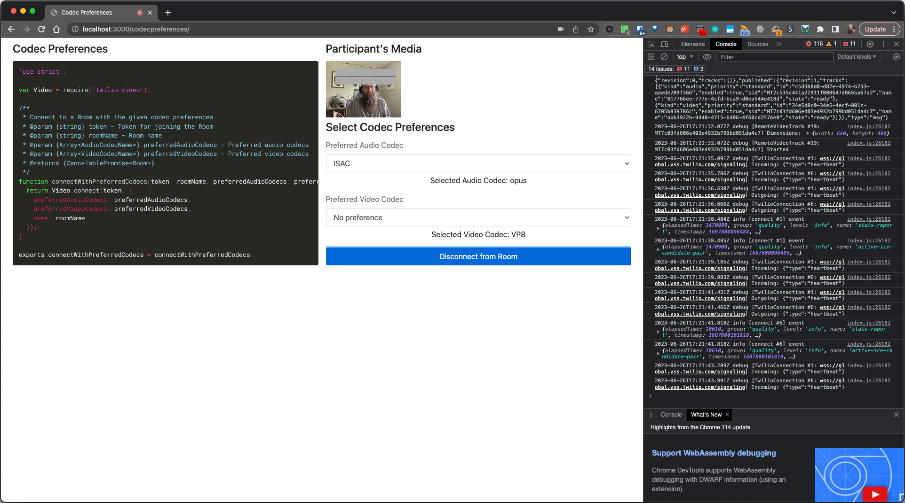
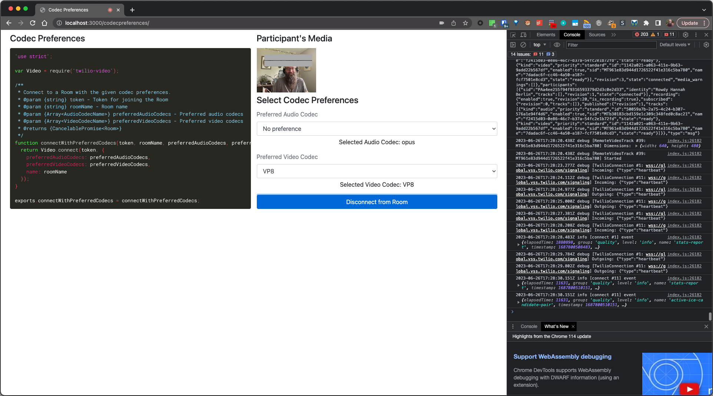
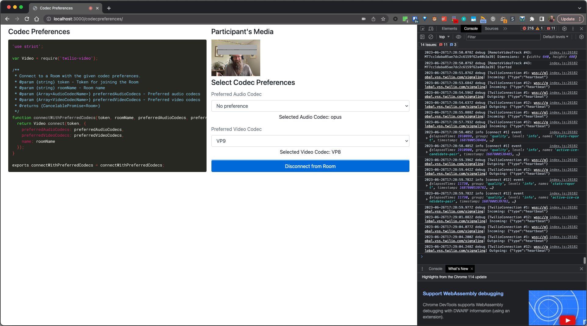
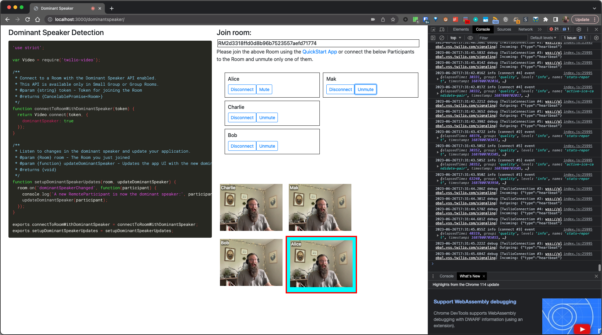

# JS Video Quickstart

## Default JS Video Quickstart - RMb8b3b0f301548cb3b8b978caa546cbf5

## Examples

### Bandwidth Restrictions

Room SID: RMb8b3b0f301548cb3b8b978caa546cbf5

**Audio**

16k Audio

32k Audio

64k Audio

**Video**

64k Video

128k Video

256k Video

512k Video

### Snapshot

Room SID: RMc16436b36dca406ee5ffb72ceea449f1

### Codecs

Room SID: RMc16436b36dca406ee5ffb72ceea449f1

Note: made sure to `Disconnect from Room` and set the codec each time

**Audio Codecs**

ISAC

OPUS

PCMA

PCMU

**Video Codecs**

H264

VP8

VP9

### Dominant Speaker

Room SID: RM2d3318ffd0d8b96b7523557aefd71774

